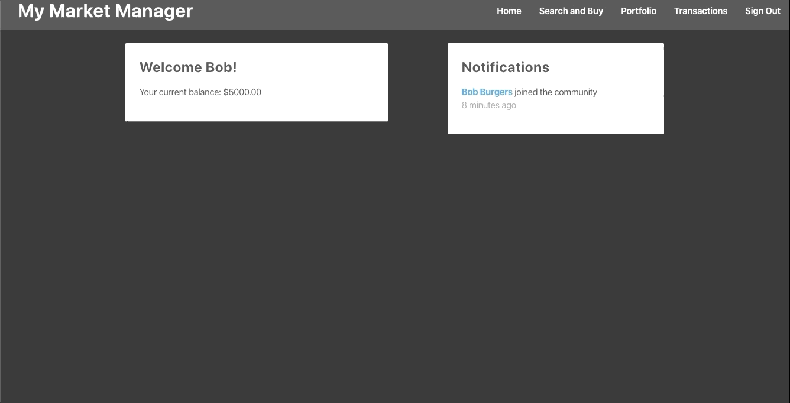
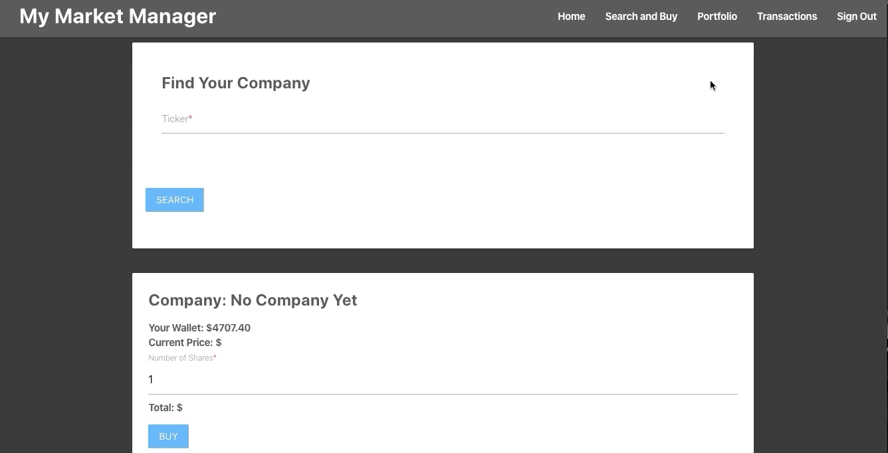

<p align="center">
  
</p>

# My-Market-Manager

Welcome to My-Market-Manager a web app that allows users to buy stock and are visually able to see how they are doing in real time. Each user will have access to a portfolio to view stock progress and transactions for a full ledger of thier stock history. This app was made using react, redux, and firestore.

## How It Works

|     Search the Buy                   
| ------------------------- |
| | 

Search for stock by specifying its unique ticker, then indicate the amount of shares you would like to buy.

|     Portfolio the Transactions                   
| ------------------------- |
| | 

After buying, the bought stock will appear in your portfolio and your transactions. Your stocks opening price will indicate how well your stock is doing.

### Setting Up Dev Environment:

- Clone the repo and `npm install` the dependencies.
- Create a Firebase project.
- Set the Firestore db rules to the following rules:

```javascript
service cloud.firestore {
  match /databases/{database}/documents {
    match /users/{userId} {
    	allow create
      allow read: if request.auth.uid != null
      allow write: if request.auth.uid == userId
    }
    match /notifications/{notifications} {
      allow read: if request.auth.uid != null
    }
  }
}
```

- Fill in your actual keys in `src/config/`.
- Create a secrets file to import your API key and fireStore Config info.
- `npm run start` will run in a dev environment.

### Setting Up Testing Environment:

- First start your Firebase emulators: `firebase emulators:start`.
- Then `npm test` to run tests.


Deploy Link: https://my-market-manager.web.app/signin